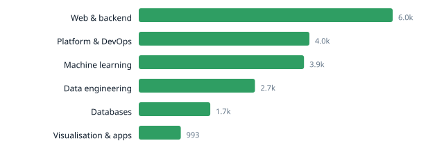

# Ecosystem Radar

[](https://github.com/Amirzamani1l/oss-momentum/actions/workflows/ci.yml)
[](https://github.com/Amirzamani1l/oss-momentum/actions/workflows/collect.yml)

A self-updating dataset tracking momentum across 42 major open-source
projects. Three times a day it pulls fresh metrics from the GitHub and
PyPI APIs, appends them to a growing time series, and rewrites the report
below.

The interesting part is not the star counts — it is the **relative growth**.
A project adding 800 stars a month on a base of 8,000 is moving faster than
one adding 2,000 on a base of 200,000, and only the second number ever
makes it into a headline.

## What it collects

Per project, per day:

| Field | Source | Why |
| --- | --- | --- |
| `stars`, `forks`, `watchers` | GitHub | Adoption signal |
| `open_issues` | GitHub | Maintenance load |
| `days_since_push` | GitHub | Is anyone still working on it |
| `release_tag`, `days_since_release` | GitHub | Shipping cadence |
| `pypi_releases`, `pypi_cadence_days` | PyPI | Median gap between releases |
| `requires_python` | PyPI | Support window drift |

Raw API responses are archived per day under `data/snapshots/`, so the
derived table can always be rebuilt from source.

## Layout

```
src/radar/
  config.py      project registry — adding a project is one line
  sources.py     HTTP transport + GitHub/PyPI clients
  transform.py   payloads -> tidy rows (pure)
  analyze.py     deltas, growth, z-scores, aggregates (pure)
  charts.py      dependency-free SVG
  report.py      Markdown + JSON rendering (pure)
  storage.py     the only module that touches disk
scripts/collect.py   pipeline entrypoint
tests/               122 tests, no network
data/observations.csv   the dataset
```

Everything except `sources.py` and `storage.py` is pure, which is why the
test suite runs in under two seconds with no network and no fixtures on
disk beyond a handful of dicts.

## Running it locally

```bash
pip install -r requirements-dev.txt

pytest                                   # 122 tests
ruff check . && ruff format --check .    # lint

# Fetch three projects and print the report without writing anything.
GITHUB_TOKEN=ghp_xxx python scripts/collect.py --dry-run --limit 3

# Full run.
GITHUB_TOKEN=ghp_xxx python scripts/collect.py

# Rebuild charts and README from stored data, no network.
python scripts/collect.py --report-only
```

A token is optional but strongly recommended: unauthenticated GitHub API
access is capped at 60 requests/hour, which is not enough for one full run.

## Design notes

**Date-anchored deltas, not row offsets.** Runs get skipped — Fridays,
API outages, GitHub disabling schedules. `delta_over` finds the newest
observation at or before the cutoff date rather than counting back N rows,
so a missed day shifts the baseline instead of silently corrupting it.

**Idempotent by date.** The pipeline runs three times a day but stores one
row per `(date, repo)`, last write wins. Re-running never duplicates a row,
and the daily diff stays small enough to read.

**Partial failure is survivable.** One dead repo records an error and the
run continues. If more than 40% of fetches fail the run aborts *before*
writing, rather than committing a hollow day that would poison every
subsequent delta.

**SVG, not PNG.** Charts are generated by hand into SVG. matplotlib would
add roughly 30 seconds to every run and commit binary blobs that make the
history unreviewable.

<!-- RADAR:START -->

## Ecosystem Radar

_Last run: **2026-08-24 02:36 UTC** · 42 projects · 84 observations · 2 days of history (2026-08-23 → 2026-08-24)_



### Fastest growing (30d, star growth as % of base)

| Project | Category | Stars | 30d | Growth | Momentum |
| --- | --- | ---: | ---: | ---: | ---: |
| [open-telemetry/opentelemetry-collector](https://github.com/open-telemetry/opentelemetry-collector) | Platform & DevOps | 7,447 | +4 | 0.05% | 4.41 |
| [optuna/optuna](https://github.com/optuna/optuna) | Machine learning | 14,693 | +4 | 0.03% | 2.28 |
| [dagster-io/dagster](https://github.com/dagster-io/dagster) | Data engineering | 16,055 | +4 | 0.02% | 1.22 |
| [unionai-oss/pandera](https://github.com/unionai-oss/pandera) | Data engineering | 4,440 | +1 | 0.02% | 1.22 |
| [valkey-io/valkey](https://github.com/valkey-io/valkey) | Databases | 26,956 | +5 | 0.02% | 1.22 |
| [pola-rs/polars](https://github.com/pola-rs/polars) | Data engineering | 39,460 | +2 | 0.01% | 0.15 |
| [questdb/questdb](https://github.com/questdb/questdb) | Databases | 17,273 | +2 | 0.01% | 0.15 |
| [ray-project/ray](https://github.com/ray-project/ray) | Machine learning | 43,587 | +4 | 0.01% | 0.15 |


### Losing momentum (30d)

| Project | Category | Stars | 30d | Growth | Momentum |
| --- | --- | ---: | ---: | ---: | ---: |
| [streamlit/streamlit](https://github.com/streamlit/streamlit) | Visualisation & apps | 45,599 | +1 | 0.00% | -0.91 |
| [postgres/postgres](https://github.com/postgres/postgres) | Databases | 21,879 | +1 | 0.00% | -0.91 |
| [prometheus/prometheus](https://github.com/prometheus/prometheus) | Platform & DevOps | 65,788 | +3 | 0.00% | -0.91 |
| [timescale/timescaledb](https://github.com/timescale/timescaledb) | Databases | 23,403 | +1 | 0.00% | -0.91 |
| [ClickHouse/ClickHouse](https://github.com/ClickHouse/ClickHouse) | Databases | 49,405 | +2 | 0.00% | -0.91 |


### Categories

| Category | Projects | Stars | 30d | Median growth | Stale |
| --- | ---: | ---: | ---: | ---: | ---: |
| Machine learning | 8 | 467,292 | +43 | 0.01% | 0 |
| Platform & DevOps | 5 | 324,059 | +29 | 0.01% | 0 |
| Web & backend | 5 | 306,731 | +23 | 0.01% | 1 |
| Data engineering | 12 | 275,793 | +21 | 0.01% | 0 |
| Databases | 6 | 215,008 | +17 | 0.00% | 0 |
| Visualisation & apps | 6 | 215,757 | +12 | 0.00% | 0 |


### Watchlist

| Project | Days since push | Open issues / 1k stars | Flag |
| --- | ---: | ---: | --- |
| [encode/httpx](https://github.com/encode/httpx) | 148 | 9.27 | stalled |
| [scikit-learn/scikit-learn](https://github.com/scikit-learn/scikit-learn) | 2 | 31.73 | issue load |
| [plotly/plotly.py](https://github.com/plotly/plotly.py) | 2 | 41.60 | issue load |
| [hashicorp/terraform](https://github.com/hashicorp/terraform) | 2 | 38.67 | issue load |
| [ibis-project/ibis](https://github.com/ibis-project/ibis) | 2 | 78.93 | issue load |
| [apache/arrow](https://github.com/apache/arrow) | 1 | 151.78 | issue load |
| [delta-io/delta](https://github.com/delta-io/delta) | 1 | 103.80 | issue load |
| [dagster-io/dagster](https://github.com/dagster-io/dagster) | 1 | 161.57 | issue load |


_Generated automatically. Methodology in [`docs/METHODOLOGY.md`](docs/METHODOLOGY.md)._

<!-- RADAR:END -->

## Licence

MIT
