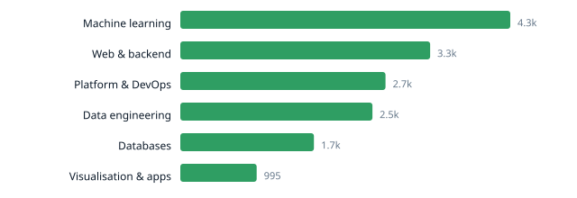

# Ecosystem Radar

[](https://github.com/Amirzamani1l/oss-momentum/actions/workflows/ci.yml)
[](https://github.com/Amirzamani1l/oss-momentum/actions/workflows/collect.yml)

A self-updating dataset tracking momentum across 42 major open-source
projects. Three times a day it pulls fresh metrics from the GitHub and
PyPI APIs, appends them to a growing time series, and rewrites the report
below.

The interesting part is not the star counts — it is the **relative growth**.
A project adding 800 stars a month on a base of 8,000 is moving faster than
one adding 2,000 on a base of 200,000, and only the second number ever
makes it into a headline.

## What it collects

Per project, per day:

| Field | Source | Why |
| --- | --- | --- |
| `stars`, `forks`, `watchers` | GitHub | Adoption signal |
| `open_issues` | GitHub | Maintenance load |
| `days_since_push` | GitHub | Is anyone still working on it |
| `release_tag`, `days_since_release` | GitHub | Shipping cadence |
| `pypi_releases`, `pypi_cadence_days` | PyPI | Median gap between releases |
| `requires_python` | PyPI | Support window drift |

Raw API responses are archived per day under `data/snapshots/`, so the
derived table can always be rebuilt from source.

## What it does with what it finds

The pipeline does not just publish numbers — it acts on them.

**Data lands through a pull request.** Each run commits to a branch,
opens a PR with a diffstat, waits for CI, and squash-merges. Every change
to the dataset is therefore reviewable after the fact, and a run that
produces a broken table fails CI instead of landing on `main`.

**Findings become issues.** After each run the analysis is checked against
five conditions, and open issues are reconciled against them:

| Finding | Condition |
| --- | --- |
| `stalled` | No push in 45 days |
| `spike` | Momentum z-score ≥ 2.5 |
| `slump` | Negative 30-day growth |
| `drought` | No release in 180 days, for a project whose median cadence is under 45 |
| `unreachable` | Three consecutive failed fetches — renamed, private or deleted |

A condition that appears opens an issue. A condition that clears closes it,
with a comment saying why. A condition that persists is left alone, so
nothing churns.

Every generated issue carries an HTML-comment marker in its body, and only
issues carrying that marker are ever touched. **Anything a human opens is
never modified or closed.**

## Layout

```
src/radar/
  config.py      project registry — adding a project is one line
  sources.py     HTTP transport + GitHub/PyPI clients
  transform.py   payloads -> tidy rows (pure)
  analyze.py     deltas, growth, z-scores, aggregates (pure)
  alerts.py      findings + issue reconciliation (pure)
  issues.py      GitHub Issues client
  charts.py      dependency-free SVG
  report.py      Markdown + JSON rendering (pure)
  storage.py     the only module that touches disk
scripts/
  collect.py     pipeline entrypoint
  sync_issues.py issue reconciliation entrypoint
tests/               181 tests, no network
data/observations.csv   the dataset
```

Everything except `sources.py` and `storage.py` is pure, which is why the
test suite runs in under two seconds with no network and no fixtures on
disk beyond a handful of dicts.

## Running it locally

```bash
pip install -r requirements-dev.txt

pytest                                   # 122 tests
ruff check . && ruff format --check .    # lint

# Fetch three projects and print the report without writing anything.
GITHUB_TOKEN=ghp_xxx python scripts/collect.py --dry-run --limit 3

# Full run.
GITHUB_TOKEN=ghp_xxx python scripts/collect.py

# Rebuild charts and README from stored data, no network.
python scripts/collect.py --report-only

# Show which issues would be opened, without a token.
python scripts/sync_issues.py --dry-run
```

A token is optional but strongly recommended: unauthenticated GitHub API
access is capped at 60 requests/hour, which is not enough for one full run.

## Design notes

**Date-anchored deltas, not row offsets.** Runs get skipped — Fridays,
API outages, GitHub disabling schedules. `delta_over` finds the newest
observation at or before the cutoff date rather than counting back N rows,
so a missed day shifts the baseline instead of silently corrupting it.

**Idempotent by date.** The pipeline runs three times a day but stores one
row per `(date, repo)`, last write wins. Re-running never duplicates a row,
and the daily diff stays small enough to read.

**Partial failure is survivable.** One dead repo records an error and the
run continues. If more than 40% of fetches fail the run aborts *before*
writing, rather than committing a hollow day that would poison every
subsequent delta.

**SVG, not PNG.** Charts are generated by hand into SVG. matplotlib would
add roughly 30 seconds to every run and commit binary blobs that make the
history unreviewable.

**Reconciliation, not notification.** The issue sync computes a desired
state and diffs it against reality, rather than firing an event whenever
something looks wrong. That is what makes it safe to run three times a day:
a condition that has not changed produces no action at all.

**Issue writes are never fatal.** `apply_plan` catches per-issue failures
and the workflow step is `continue-on-error`. A rejected issue write must
not fail a run whose data has already merged.

<!-- RADAR:START -->

## Ecosystem Radar

_Last run: **2026-10-08 16:56 UTC** · 42 projects · 1,848 observations · 44 days of history (2026-08-23 → 2026-10-08)_



### Fastest growing (30d, star growth as % of base)

| Project | Category | Stars | 30d | Growth | Momentum |
| --- | --- | ---: | ---: | ---: | ---: |
| [duckdb/duckdb](https://github.com/duckdb/duckdb) | Data engineering | 41,986 | +912 | 2.22% | 3.21 |
| [pallets/flask](https://github.com/pallets/flask) | Web & backend | 74,933 | +1,352 | 1.84% | 2.35 |
| [open-telemetry/opentelemetry-collector](https://github.com/open-telemetry/opentelemetry-collector) | Platform & DevOps | 7,644 | +134 | 1.78% | 2.22 |
| [mlflow/mlflow](https://github.com/mlflow/mlflow) | Machine learning | 28,314 | +446 | 1.60% | 1.81 |
| [dbt-labs/dbt-core](https://github.com/dbt-labs/dbt-core) | Data engineering | 13,977 | +185 | 1.34% | 1.22 |
| [postgres/postgres](https://github.com/postgres/postgres) | Databases | 22,313 | +262 | 1.19% | 0.88 |
| [huggingface/transformers](https://github.com/huggingface/transformers) | Machine learning | 166,951 | +1,949 | 1.18% | 0.86 |
| [ClickHouse/ClickHouse](https://github.com/ClickHouse/ClickHouse) | Databases | 50,300 | +559 | 1.12% | 0.72 |


### Losing momentum (30d)

| Project | Category | Stars | 30d | Growth | Momentum |
| --- | --- | ---: | ---: | ---: | ---: |
| [altair-viz/altair](https://github.com/altair-viz/altair) | Visualisation & apps | 10,493 | +24 | 0.23% | -1.30 |
| [ibis-project/ibis](https://github.com/ibis-project/ibis) | Data engineering | 6,676 | +18 | 0.27% | -1.21 |
| [plotly/plotly.py](https://github.com/plotly/plotly.py) | Visualisation & apps | 18,827 | +59 | 0.31% | -1.12 |
| [dmlc/xgboost](https://github.com/dmlc/xgboost) | Machine learning | 28,838 | +96 | 0.33% | -1.07 |
| [scikit-learn/scikit-learn](https://github.com/scikit-learn/scikit-learn) | Machine learning | 67,496 | +278 | 0.41% | -0.89 |


### Categories

| Category | Projects | Stars | 30d | Median growth | Stale |
| --- | ---: | ---: | ---: | ---: | ---: |
| Machine learning | 8 | 473,233 | +4,274 | 0.73% | 0 |
| Web & backend | 5 | 313,673 | +3,292 | 0.77% | 0 |
| Data engineering | 12 | 279,970 | +2,600 | 0.76% | 0 |
| Platform & DevOps | 5 | 329,343 | +2,596 | 0.63% | 0 |
| Databases | 6 | 217,748 | +1,736 | 0.84% | 0 |
| Visualisation & apps | 6 | 217,344 | +1,009 | 0.44% | 0 |


### Watchlist

| Project | Days since push | Open issues / 1k stars | Flag |
| --- | ---: | ---: | --- |
| [microsoft/LightGBM](https://github.com/microsoft/LightGBM) | 2 | 28.87 | issue load |
| [scikit-learn/scikit-learn](https://github.com/scikit-learn/scikit-learn) | 1 | 31.97 | issue load |
| [kubernetes/kubernetes](https://github.com/kubernetes/kubernetes) | 0 | 25.11 | issue load |
| [grafana/grafana](https://github.com/grafana/grafana) | 0 | 42.96 | issue load |
| [dbt-labs/dbt-core](https://github.com/dbt-labs/dbt-core) | 0 | 124.13 | issue load |
| [dagster-io/dagster](https://github.com/dagster-io/dagster) | 0 | 158.54 | issue load |
| [apache/iceberg](https://github.com/apache/iceberg) | 0 | 99.37 | issue load |
| [apache/arrow](https://github.com/apache/arrow) | 0 | 143.11 | issue load |


_Generated automatically. Methodology in [`docs/METHODOLOGY.md`](docs/METHODOLOGY.md)._

<!-- RADAR:END -->

## Licence

MIT
